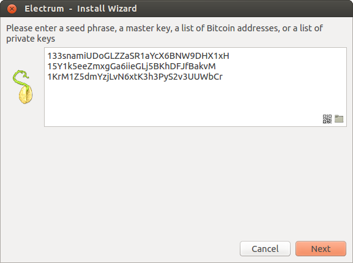
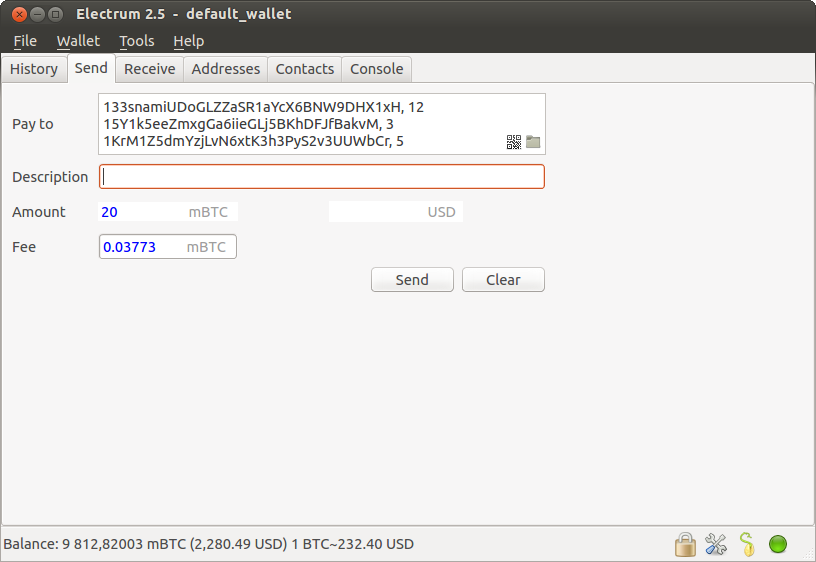

Frequently Asked Questions
==========================

What is Electron Cash?
----------------------

Electron Cash is a light wallet client for Bitcoin Cash. 

How does Electron Cash work?
----------------------------

Electron Cash's focus is speed, with low resource usage and
simplifying Bitcoin Cash. Startup times are instant because it
operates in conjunction with high-performance servers that
handle the most complicated parts of the Bitcoin Cash system.

Does Electron Cash trust servers?
---------------------------------

Not really; the Electron Cash client never sends private keys
to the servers. In addition, it verifies the information
reported by servers, using a technique called :ref:`Simplified Payment Verification <spv>`

What is the Seed?
-----------------

The seed is a random phrase that is used to generate your private
keys.

Example:

.. code-block:: none

   constant forest adore false green weave stop guy fur freeze giggle clock

Your wallet can be entirely recovered from its seed, so your seed phrase should be 
written down and stored in a safe place. To restore your wallet from the seed, select
the "restore wallet" option in the startup.

How secure is the seed?
-----------------------

The seed phrase created by Electron Cash has 132 bits of entropy. This
means that it provides the same level of security as a Bitcoin Cash private
key (of length 256 bits). Indeed, an elliptic curve key of length n
provides n/2 bits of security.

I have forgotten my password. What can I do?
--------------------------------------------

It is not possible to recover your password. However, you can restore
your wallet from its seed phrase, and choose a new password. 
If you lose both your password and your seed, there is no way 
to recover your money. This is why we ask you to save your seed
phrase on paper.

My transaction has been unconfirmed for a long time. What can I do?
-------------------------------------------------------------------

Bitcoin Cash transactions become 'confirmed' when miners include them in a
new block on the Bitcoin Cash blockchain. The speed at which transactions 
are confirmed depends on two things: random variance in the time between 
blocks, and the fee that you attach to your transaction. 

Whilst blocks are found on average every 10 minutes, they are also quite 
often found more and less frequently. If some time has passed and you're 
still waiting for your transaction to be confirmed, the first thing to check 
is whether a block has been found. You can do this using your favorite 
block explorer. If you find that random variance is the cause for the delay, 
just wait, it shouldn't be too much longer.

Because the Bitcoin Cash network has plenty of headroom, the blocks are
rarely congested. This means that fees stay consistently low. By default, 
Electron Cash will recommend a network fee of 1 satoshi per byte, which 
will usually be sufficient for inclusion in the next block. Whilst the fee rate 
can  be customised, it should not be set any lower than 1 sat/byte, and 
transactions paying less than 1 sat/byte will usually be rejected by the network.

What does it mean to "Freeze" an address in Electron Cash?
----------------------------------------------------------

When you freeze an address, the funds in that address will not be used
for sending Bitcoin Cash. You can not send Bitcoin Cash if you don't have
enough funds in the non-frozen addresses.

Additionally, Electron Cash may freeze a previously used address to increase 
privacy. This is often done in conjunction with using CashShuffle. Address reuse 
will damage your privacy by linking the various addresses in your wallet. 
Freezing used addresses prevents this.
          

How is the wallet encrypted?
----------------------------

Electron Cash uses two separate levels of encryption:

 - Your seed and private keys are encrypted using AES-256-CBC. The
   private keys are decrypted only briefly, when you need to sign a
   transaction; for this you need to enter your password. This is done
   in order to minimize the amount of time during which sensitive
   information is unencrypted in your computer's memory.

 - In addition, your wallet file may be encrypted on disk. Note that
   the wallet information will remain unencrypted in the memory of
   your computer for the duration of your session. If a wallet is
   encrypted, then its password will be required in order to open
   it. Note that the password will not be kept in memory; Electron Cash
   does not need it in order to save the wallet on disk, because it
   uses asymmetric encryption (ECIES).

Wallet file encryption is activated by default since version 2.8.

Does Electron Cash support cold wallets?
----------------------------------------

Yes. see :ref:`Cold Storage <coldstorage>`

Can I import private keys from other Bitcoin Cash clients?
----------------------------------------------------------

You have two options when wanting to import private keys from other 
Bitcoin Cash clients. 

1. If you would like to recover funds held with private keys, the 
best practice is to sweep the addresses associated with these private 
keys to one of your Electron Cash wallets. Click here for more information on sweeping.

2. If you would like to import the private keys rather than sweep them, 
then you need to create a new wallet. This will need to be a special 
wallet that does not have a seed. To do this, create a new wallet, 
select "restore", and instead of typing your seed, type a
list of private keys, or a list of addresses if you want to create a
watching-only wallet.

You will need to create a backup of this wallet, because it cannot be
recovered from seed.

Can I sweep private keys from other Bitcoin Cash clients?
---------------------------------------------------------

Sweeping private keys means sending all of the Bitcoin Cash that they control to
an existing address in your wallet. The private keys that you sweep do not
become a part of your wallet. Instead, all the Bitcoin Cash that they control
are sent to an address that has been deterministically generated from
your wallet seed.

To sweep private keys go to Wallet menu -> Private Keys ->
Sweep. Enter the private keys in the appropriate field. Leave the
'Address' field unchanged. That is the destination address and it'll
be from your existing Electron Cash wallet.

Where is my wallet file located?
--------------------------------

The default wallet file is called default_wallet which is created when
you first run the application and located under the /wallets folder.

On Windows:

 - Show hidden files
 - Go to \\Users\\YourUserName\\AppData\\Roaming\\Electron Cash\\wallets (or %APPDATA%\\Electrum\\wallets)

On Mac:

- Open Finder
- Go to folder (shift+cmd+G) and type ~/.electron-cash

On Linux:

- Home Folder
- Go -> Location and type ~/.electron-cash

Can I do bulk payments with Electron Cash?
------------------------------------------

You can create a transaction with several outputs. In the GUI, type
each address and amount on a line, separated by a comma.

Amounts are in the current unit set in the client. The
total is shown in the GUI.

You can also import a CSV file in the 'Pay to' field, by clicking on
the folder icon.

Can Electron Cash create and sign raw transactions?
---------------------------------------------------

Electron Cash lets you create and sign raw transactions right from the user
interface using a form.

Electron Cash freezes when I try to send Bitcoin Cash
-----------------------------------------------------

This might happen if you are trying to spend a large number of
transactions outputs (for example, if you have collected hundreds of
donations from a faucet).  When you send Bitcoin Cash, Electron Cash
looks for unspent coins that are in your wallet, in order to create a
new transaction. Unspent coins can have different values, much like
physical coins and bills.

If this happens, you should consolidate your transaction inputs, by
sending smaller amounts of bitcoins to one of your wallet addresses;
this would be the equivalent of exchanging a stack of nickels for a
dollar bill.

.. _gap limit:

What is the gap limit?
----------------------

The gap limit is the maximum number of consecutive unused addresses in
your deterministic sequence of addresses.  Electron Cash uses it in order
to stop looking for addresses. In Electron Cash, it is set to 20 by
default, so the client will get all addresses until 20 unused
addresses are found.
          

How can I pre-generate new addresses?
-------------------------------------

Electron Cash will generate new addresses as you use them,
until it hits the `gap limit`_

If you need to pre-generate more addresses, you can do so by typing
wallet.create_new_address(False) in the console. This command will generate
one new address. Note that the address will be shown with a red
background in the address tab, to indicate that it is beyond the gap
limit. The red color will remain until the gap is filled.

WARNING: Addresses beyond the gap limit will not automatically be
recovered from seed. To recover them will require either increasing
the client's gap limit or generating new addresses until the used
addresses are found.

If you wish to generate more than one address, you may use a 'for'
loop. For example, if you wanted to generate 50 addresses, you could
do this:

.. code-block:: python

   for x in range(0, 50):
	print wallet.create_new_address(False)

How to upgrade Electron Cash?
-----------------------------

Warning: always save your wallet seed on paper before
doing an upgrade.

To upgrade Electron Cash, just install the most recent version.
The way to do this will depend on your OS.

Note that your wallet files are stored separately from the
software, so you can safely remove the old version of the
software if your OS does not do it for you.

Some Electron Cash upgrades will modify the format of your
wallet files.

For this reason, it is not recommended to downgrade
Electron Cash to an older version, once you have opened your
wallet file with the new version. The older version will
not always be able to read the new wallet file.
